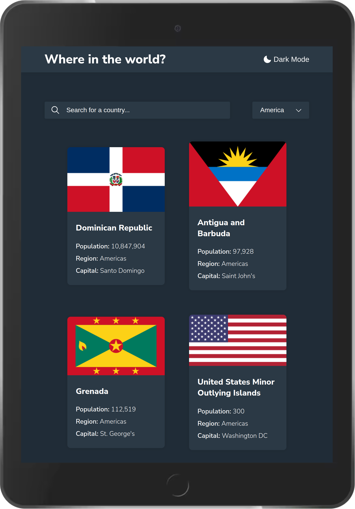

# Frontend Mentor - REST Countries API with color theme switcher solution

This is a solution to the [REST Countries API with color theme switcher challenge on Frontend Mentor](https://www.frontendmentor.io/challenges/rest-countries-api-with-color-theme-switcher-5cacc469fec04111f7b848ca). Frontend Mentor challenges help you improve your coding skills by building realistic projects.

## Table of contents

-   [Overview](#overview)
    -   [The challenge](#the-challenge)
    -   [Screenshot](#screenshot)
    -   [Links](#links)
-   [My process](#my-process)
    -   [Built with](#built-with)
    -   [What I learned](#what-i-learned)
-   [Author](#author)

## Overview

### The challenge

Users should be able to:

-   See all countries from the API on the homepage
-   Search for a country using an `input` field
-   Filter countries by region
-   Click on a country to see more detailed information on a separate page
-   Click through to the border countries on the detail page
-   Toggle the color scheme between light and dark mode _(optional)_

### Screenshot

 

 
 

 

 
 

 
 

 

### Links

-   Solution URL: [github](https://github.com/mani-cmd/where-in-the-world)
-   Live Site URL: [vercel](https://where-in-the-world-mani-cmd.vercel.app/)

## My process

### Built with

-   Semantic HTML5 markup
-   CSS custom properties
-   Flexbox
-   [ViteJs](https://vitejs.dev/) - JS library
-   [Sass](https://sass-lang.com/) - CSS preprocessor
-   [Axios](https://axios-http.com/docs/intro) - For fetching API's

### What I learned

I have learned a lot by building this project. Some of them were new to me. The most intresting peice of code I learned is [Object.values()](https://devdocs.io/javascript/global_objects/object/values) property in javascript. Axios made it very easy for me to fetch API requests. In this project I created theme toggle to dark mode and stored the prefered theme in local storage so when they visit again it stay's the same them. I am really proud of this project because I built it on my own without following any tutorial on youtube.(with documentation's help)

## Author

-   Website - [Manikandan](https://mani-cmd.github.io)
-   Frontend Mentor - [@mani-cmd](https://www.frontendmentor.io/profile/mani-cmd)
-   Twitter - [@copyninja_03](https://www.twitter.com/copyninja_03)
